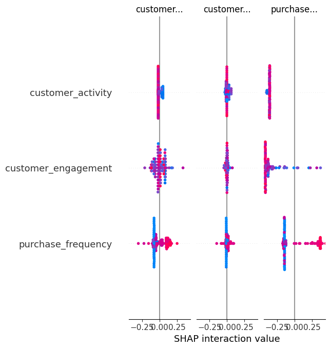

# customer-value-analysis
Achieved 97% model accuracy
Applied SHAP for model interpretability
Translated ML results into business insights
ML + SHAP customer analysis
Customer Value Prediction & Key Driver Analysis
📌 Project Overview

This project aims to identify high-value customers and understand the key factors driving customer value using machine learning and model interpretability (SHAP).

🎯 Business Problem
In many businesses, identifying high-value customers is critical for revenue growth.

However, companies often focus on increasing transaction size rather than understanding customer behavior.

This project addresses that problem by using machine learning and SHAP to uncover the true drivers of customer value.

Beauty Salon Chain Company want to know:

Who are their most valuable customers?
What drives customer value?

Understanding these helps improve marketing efficiency and customer retention.

📊 Dataset

The dataset is adapted from the Iris dataset and mapped to a business context:

Feature	Business Meaning
Purchase frequency
Transaction amount
Customer activity
Customer engagement
⚙️ Methodology
Built a classification model to predict high-value customers
Achieved 97% accuracy
Applied SHAP to interpret model predictions
🔍 Key Insights
Purchase frequency is the most important factor
Transaction size is less influential than expected
High-value customers are driven more by behavior than one-time spending
💡 Business Recommendations
Focus on increasing customer purchase frequency
Implement loyalty or subscription programs
Target high-frequency users with personalized marketing
📈 Tools & Skills
Python (Pandas, Scikit-learn)
SHAP (Model Interpretability)
Data Analysis & Business Insight
🚀 Future Improvements
Add dashboard (Power BI / Tableau)
Use real-world customer dataset
Deploy model as API

## 🤖 Why SHAP?

Instead of treating the model as a black box, SHAP was used to explain individual predictions and feature importance.

This allows us to:

* Understand how each feature impacts predictions
* Build trust in the model
* Translate model outputs into business decisions

## 🧠 Key Takeaway

This project shows that the value of machine learning is not just prediction accuracy, but the ability to generate actionable business insights.

## 📊 Model Interpretation

